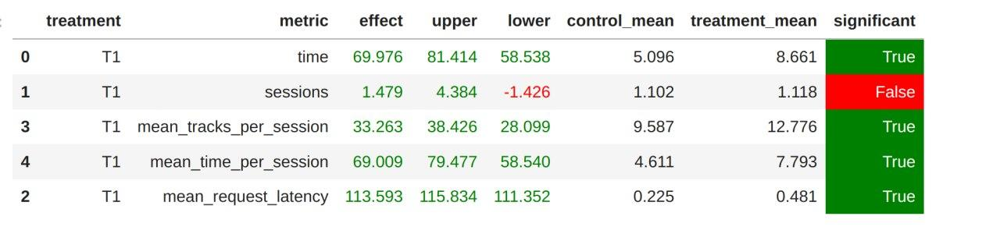

# Рекомендательные Системы в Продакшене

## Домашнее задание

## Подход
Менялась логика генерации рекомендаций, данные были взяты с последнего нейросетевого рекоммендера
.
Храним буфер прослушанных треков и первый прослушанный трек для каждого пользователя.

Смотрим на предыдущий трек — если время его прослушивания меньше порога (time_threshold, который был экспериментально подобран), то выбираем из рекомендаций первого трека, но проверяем, что трек не был прослушан ранее (храним последние 20 прослушанных треков). 
Если же рекомендаций первого/предыдущего трека нет, то смотрим на рекомендации рандомного из последних  прослушанных треков.

Подход позволил добиться следующего улучшения контекстуального рекомендера:

## Другие идеи, которые не заработали

1. Использование любого другого рекомендера кроме рандомного при fallback
2. Обучение эмбеддингов юзера
3. Хранение непонравившихся треков
4. Использование косинусного расстояния вместо скалярного произведения

## Запуск
Аналогичен запуску A/B тестов с семинара:

cd botify
docker compose up -d --build

cd sim
python sim/run.py --episodes 2000 --config config/env.yml single --recommender remote --seed 31337
docker cp recommender-container:/app/log/ ../

Запуск ноутбук с  1 семинара
 
